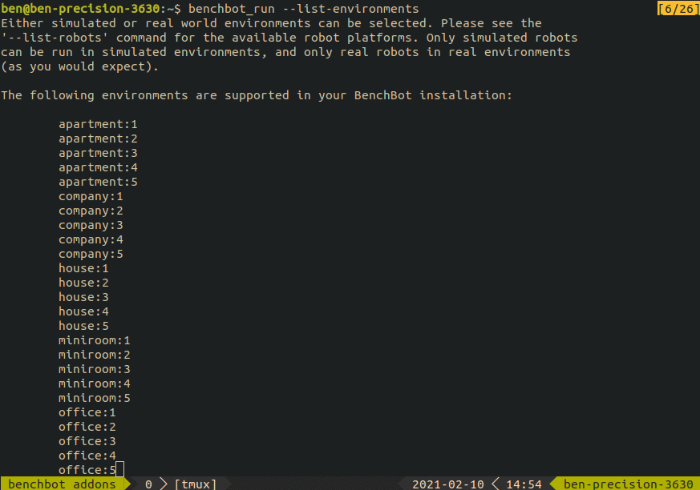

**NOTE: this software is part of the BenchBot software stack, and not intended to be run in isolation (although it can be installed independently through pip & if desired). For a working BenchBot system, please install the BenchBot software stack by following the instructions [here](https://github.com/roboticvisionorg/benchbot).**

# BenchBot Add-ons Manager



The BenchBot Add-ons Manager allows you to use BenchBot with a wide array of additional content, and customise your installation to suite your needs. Semantic Scene Understanding not your thing? Install the Semantic Question Answering add-ons instead. Want to create your own content? Write some basic YAML files to make your own add-ons. Need to re-use existing content? Simply include a dependency on that add-on. Add-ons are all about making BenchBot whatever you need it to be&mdash;build a BenchBot for your research problems, exactly as you need it.

Add-ons come in a variety of types. Anything that you may need to customise for your own experiments or research, should be customisable through an add-on. If not, let us know, and we'll add more add-on enabled functionality to BenchBot!

The list of currently supported types of add-ons are:

- **batches**: a list of environments used for repeatable evaluation scores with the `benchbot_batch` script.
- **environments**: simulated or real world environments that a task can be performed in, with a robot. Only [Isaac Sim](https://developer.nvidia.com/Isaac-sim) simulation is currently supported, but there is capacity to support other simulators. Please get in contact if you'd like to see another simulator in BenchBot!
- **evaluation_methods**: a method for evaluating a set of formatted results, against a corresponding ground truth, and producing scores describing how well a result performed a given task.
- **formats**: formalisation of a format for results or ground truth data, including helper functions.
- **ground_truths**: ground truth data in a declared format, about a specific environment. Environments can have many different types of ground truths depending on what different task's require.
- **robots**: a robot definition declaring the communication channels available to the BenchBot ecosystem. Both simulated and real world robots are supported, they just need to run ROS.
- **tasks**: a task is something a robot may want to do, what observations and actions it has available, and how results should be reported.

See the sections below for details of how to interact with installed add-ons, how to create your own add-ons, and formalisation of what's required in an add-on.

## Installing and Using the add-ons manager

In general, you won't use the add-ons manager directly. Instead you interact with the [BenchBot software stack](https://github.com/roboticvisionorg/benchbot), which uses the add-ons manager to manage and access add-ons.

The manager is a Python package if you do find you want to use it directly, and installable with pip. Run the following in the root directory where the repository was cloned:

```
u@pc:~$ pip install .
```

The manager can then be imported and used to manage installation, loading, accessing, processing, and updating of add-ons. Some samples of supported functionality are shown below:

```python
from benchbot_addons import manager as bam

# Check if example with 'name' = 'hello_scd' exists
bam.exists('examples', [('name', 'hello_scd')])

# Find all installed environments
bam.find_all('environments')

# Get a list of the names for all installed tasks
bam.get_field('tasks', 'name')

# Get a list of (name, variant) pairs for all installed environments
bam.get_fields('environments', ['name', 'variant'])

# Find a robot with 'name' = 'carter'
bam.get_match('robots', [('name', 'carter')])

# Get the 'results_format' value for the task called 'scd:passive:ground_truth'
bam.get_value_by_name('tasks', 'scd:passive:ground_truth', 'results_format')

# Load YAML data for all installed ground truths
bam.load_yaml_list(bam.find_all('ground_truths', extension='json'))

# Install a list of comma-separated add-ons
bam.install_addons('ssu,sqa')

# Install a specific add-on (& it's dependencies)
bam.install_addon('tasks_ssu')

# Print the list of currently installed add-ons, & officially available add-ons
bam.print_state()

# Uninstall all add-ons
bam.remove_addons()

# Uninstall a string separated list of add-ons
bam.remove_addon('ssu,sqa')
```

## How to add your own add-ons

## Add-ons format specification
